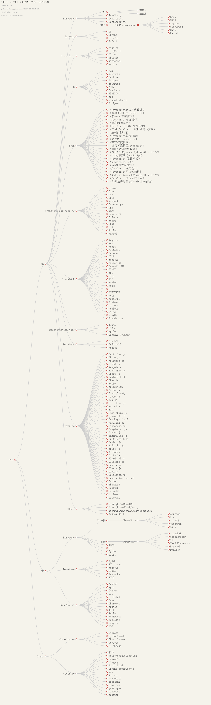

# FSE-SKILL-TREE
全栈工程师技能树梳理

点击链接加入群【Web全栈大神群】：https://jq.qq.com/?_wv=1027&k=53iWbrr

更新时间：2018-03-14 22:12

# 前端  

  前端知识点

## 语言  

  前端语言

### HTML  

#### HTML4  

#### HTML5  

### JavaScript  

### TypeScript  

[site](http://www.typescriptlang.org/)  

### CoffeeScript  

[site](http://coffeescript.org/)  

### CSS  

LESS  

SASS  

Stylus  

## 浏览器  

### IE浏览器  

[site](https://support.microsoft.com/zh-cn/help/17621/internet-explorer-downloads)  

### Chrome浏览器  

[site](https://www.google.cn/chrome/)  

### Firefox浏览器  

[site](http://www.firefox.com.cn/)  

### Safari浏览器  

[site](https://www.apple.com/cn/safari/)  

## 调试工具  

### Fiddler  

[site](https://www.telerik.com/fiddler)  

### YSlow  

[site](http://yslow.org/)  

### whistle  

[github](https://github.com/avwo/whistle)  

### wireshark  

[site](https://www.wireshark.org/)  

### weinre  

[site](http://people.apache.org/~pmuellr/weinre/)  [github](https://www.npmjs.com/package/weinre)  

## 编辑器  

VIM  [site](https://www.vim.org/)  

Webstorm  [site](http://www.jetbrains.com/webstorm/?fromMenu)  

Sublime  [site](https://www.sublimetext.com/)  

Notepad++  [site](https://notepad-plus-plus.org/)  

EditPlus  [site](https://www.editplus.com/)  

ATOM  [site](https://atom.io/)  

Brackets  [site](http://brackets.io/)  

HBuilder  [site](http://www.dcloud.io/)  

Ace  [site](https://ace.c9.io/)  [github](https://github.com/ajaxorg/ace)  

Visual Studio  [site](https://www.visualstudio.com/)  

Eclipse  [site](http://www.eclipse.org/)  

## 前端书籍  

《JavaScript高级程序设计》  

《编写可维护的JavaScript》  

《jQuery 权威指南》  

《Javascript语言精粹》  

《锋利的jQuery》  

《JavaScript DOM 编程艺术》  

《学习 JavaScript 数据结构与算法》  

《ES6标准入门》  

《JavaScript忍者秘籍》  

《高性能 JavaScript》  

《HTTP权威指南》  

《编写可维护的JavaScript》  

《HTML5高级程序设计》  

《基于MVC的JavaScript Web富应用开发》  

《你不知道的 JavaScript》  

《JavaScript 设计模式》  

《webkit技术内幕》  

《web性能权威指南》  

《JavaScript框架设计》  

《JavaScript函数式编程》  

《Node.js+MongoDB+AngularJS Web开发》  

《JavaScript快速全栈开发》  

《数据结构与算法JavaScript描述》  

## 前端工程化  

  前端工程化

Yeoman  [site](http://yeoman.io/)  

Bower  [site](https://bower.io/)  

Grunt  [site](https://gruntjs.com/)  

Gulp  [site](https://gulpjs.com/)  

Webpack  [site](https://webpack.js.org/)  

Browsersync  [site](https://browsersync.io/)  [resources]([object Object])  

npm  [site](https://www.npmjs.com/)  

yarn  [site](https://yarnpkg.com/en/)  

Travis Ci  [site](https://www.travis-ci.org/)  

Codecov  [site](https://codecov.io/)  

Mocha  [site](https://mochajs.org/)  

Chai  [site](http://www.chaijs.com/)  

FIS  [site](http://fis.baidu.com/)  [github](https://github.com/fex-team/fis3)  

Rollup  [site](https://rollupjs.org)  

Parcel  [site](https://parceljs.org/)  [github](https://github.com/parcel-bundler/parcel)  

